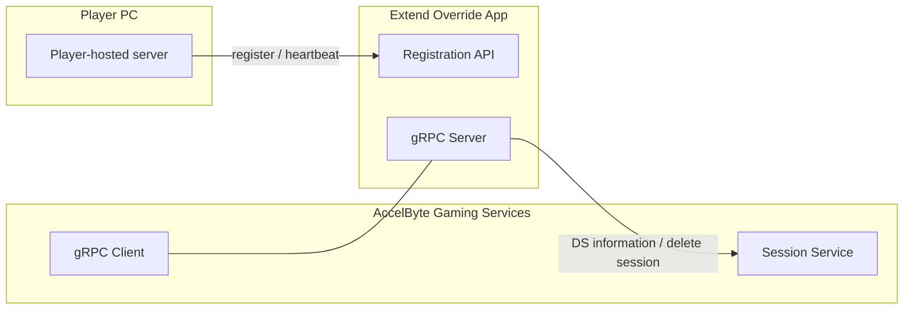
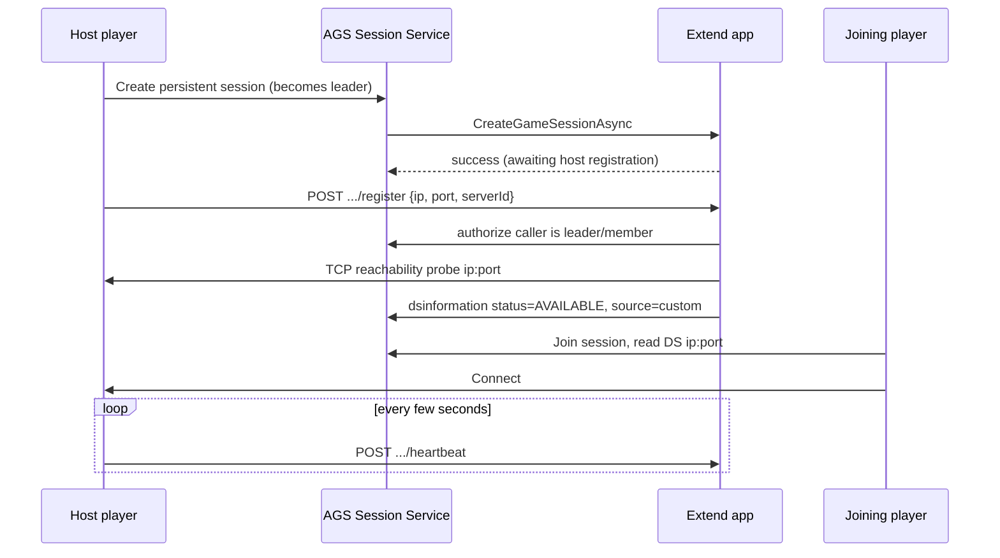

# extend-player-hosted-server



`AccelByte Gaming Services` (AGS) features can be customized using
`Extend Override` apps. An `Extend Override` app is basically a `gRPC server` which
contains one or more custom functions which can be called by AGS instead of the
default functions.

## Overview

This repository is an example `Extend Override` app template, written in `Go`, for
**player-hosted servers with persistent sessions**. The game server is run by a
*player* on their own machine with a public IP (self-host / listen-server model), or
by your own VMs or bare-metal machines, rather than taken from a managed fleet. The
host registers its address with this app. The app validates it and reports it to the
AGS session so that other players can connect.

It implements the `session dsm` (Dedicated Server Management) override with
`dsSource=custom`, and it includes:

- An async `CreateGameSessionAsync` handler that waits for the host to register.
- A host-facing HTTP **registration API** (register + heartbeat), with session
  membership authorization and a reachability probe.
- A heartbeat monitor that reports `DS_ERROR` when a host goes silent.
- **Lifecycle policies** that end persistent sessions which no longer have a host or
  players.
- Three demo binaries that run the whole flow against a real AGS namespace.
- The essential `gRPC server` authentication and authorization, and built-in
  instrumentation for observability (metrics, traces and logs).

Clone this repository and adapt the hosting rules and lifecycle policies to your
game.

### The Extend app owns the persistent session's lifecycle

> :warning: **AGS does not clean up these sessions for you.** A persistent session
> does not expire on its own (`ttlHours` is ignored for persistent sessions), and a
> failed or lost DS does not end it: AGS keeps the session and requests a DS again.
> **This app decides when the session ends.**

Out of the box the app ends a session in these cases:

| Trigger | What the app does | Configured by |
|---|---|---|
| Host stops heartbeating | Reports `DS_ERROR`. The session is kept, and AGS re-requests a DS (the host, or a new one, can register again). | `PLAYERHOSTED_HEARTBEAT_TIMEOUT` |
| No live host for X (never registered, heartbeat lost, registration timed out) | Deletes the AGS session. | `PLAYERHOSTED_HOSTLESS_SESSION_TIMEOUT` (default `10m`, `0` disables) |
| No players for X (an `AVAILABLE` session has no member with status `JOINED`/`CONNECTED`) | Deletes the AGS session. | `PLAYERHOSTED_EMPTY_SESSION_TIMEOUT` (default `30m`, `0` disables) |
| Explicit end (your game, the host or an admin deletes the session) | AGS calls `TerminateGameSession` and the app forgets the session. | Your game / admin tools |

These are the places to customize:

| What | Where |
|---|---|
| End-of-session policies (hostless, empty, add your own) | `Registry.sweep`, `Registry.checkEmpty` and `Registry.endSession` in [pkg/client/playerhosted/client.go](pkg/client/playerhosted/client.go) |
| What counts as an "active" player | `hasActiveMember` in the same file |
| Who is allowed to host | `RegistrationHandler.authorizeMembership` in [pkg/server/playerhosted/registration.go](pkg/server/playerhosted/registration.go) |
| Address validation (reachability, allow/deny lists) | `RegistrationHandler.register` in the same file |
| Host migration on heartbeat loss | `TODO(host-migration)` in `Registry.StartHeartbeatMonitor` |

> :exclamation: The registry is **in memory**. If the app restarts, it forgets the
> sessions it was tracking, and their policies stop running until AGS issues a new DS
> request for them. Run a single replica, or move the registry to shared storage
> (for example a database or AGS CloudSave) before you rely on it in production.

## Prerequisites

1. Windows 11 WSL2 or Linux Ubuntu 22.04 or macOS 14+ with the following tools installed.

   a. Bash

      ```
      bash --version

      GNU bash, version 5.1.16(1)-release (x86_64-pc-linux-gnu)
      ...
      ```

   b. Make

      - To install from Ubuntu repository, run: `sudo apt update && sudo apt install make`

      ```
      make --version

      GNU Make 4.3
      ...
      ```

   c. Docker (Docker Engine v23.0+)

      - To install from Ubuntu repository, run: `sudo apt update && sudo apt install docker.io docker-buildx docker-compose-v2`
      - Add your user to `docker` group: `sudo usermod -aG docker $USER`
      - Log out and log back in so that the changes take effect

      ```
      docker version

      ...
      Server: Docker Desktop
       Engine:
        Version:          24.0.5
      ...
      ```

   d. Go v1.24

      - Follow [Go installation](https://go.dev/doc/install) instruction to install Go

      ```
      go version

      go version go1.24.0 linux/amd64
      ```

   e. [extend-helper-cli](https://github.com/AccelByte/extend-helper-cli)

      - Use the available binary from [extend-helper-cli](https://github.com/AccelByte/extend-helper-cli/releases).

   f. Local tunnel service that has TCP forwarding capability, such as:

      - [Ngrok](https://ngrok.com/)

         Need registration for free tier. Please refer to [ngrok documentation](https://ngrok.com/docs/getting-started/) for a quick start.

      - [Pinggy](https://pinggy.io/)

         Free to try without registration. Please refer to [pinggy documentation](https://pinggy.io/docs/) for a quick start.

   > :exclamation: In macOS, you may use [Homebrew](https://brew.sh/) to easily install some of the tools above.

2. A local copy of this repository.

   ```
   git clone <this-repository-url> extend-player-hosted-server
   ```

3. Access to an AccelByte Gaming Services environment.

   a. Base URL

      - Sample URL for AGS Shared Cloud customers: https://spaceshooter.prod.gamingservices.accelbyte.io

   b. [Create a Game Namespace](https://docs.accelbyte.io/gaming-services/modules/foundations/identity-access/namespaces/manage-your-namespaces/) if you don't have one yet. Keep the `Namespace ID`.

   c. [Create an OAuth Client](https://docs.accelbyte.io/gaming-services/modules/foundations/identity-access/authorization/manage-access-control-for-applications/#create-an-iam-client) with confidential client type and the permissions listed in [IAM permissions](#iam-permissions). Keep the `Client ID` and `Client Secret`.

## Setup

1. Create a docker compose `.env` file by copying the content of
   [.env.template](.env.template) file.

   > :warning: **The host OS environment variables have higher precedence compared to `.env` file variables**: If the variables in `.env` file do not seem to take
   effect properly, check if there are host OS environment variables with the
   same name. See documentation about
   [docker compose environment variables precedence](https://docs.docker.com/compose/how-tos/environment-variables/envvars-precedence/)
   for more details.

2. Fill in the required environment variables in `.env` file as shown below.

   ```
   AB_BASE_URL=https://prod.gamingservices.accelbyte.io        # Base URL of AccelByte Gaming Services prod environment
   AB_CLIENT_ID='xxxxxxxxxx'                                   # Client ID from the Prerequisites section
   AB_CLIENT_SECRET='xxxxxxxxxx'                               # Client Secret from the Prerequisites section
   AB_NAMESPACE='xxxxxxxxxx'                                   # Namespace ID from the Prerequisites section
   PLUGIN_GRPC_SERVER_AUTH_ENABLED=true                        # Enable or disable access token and permission verification

   PLAYERHOSTED_REG_PORT=8081                                  # Port for the host registration HTTP server
   PLAYERHOSTED_REG_TIMEOUT=120s                               # Wait for a host to register before failing the DS request
   PLAYERHOSTED_HEARTBEAT_TIMEOUT=60s                          # Report DS_ERROR if no heartbeat within this window
   PLAYERHOSTED_HEARTBEAT_INTERVAL=15s                         # How often the lifecycle sweep runs
   PLAYERHOSTED_REACHABILITY_TIMEOUT=5s                        # TCP dial timeout when probing a registered host address
   PLAYERHOSTED_HOSTLESS_SESSION_TIMEOUT=10m                   # Delete the session after no live host for this long (0 disables)
   PLAYERHOSTED_EMPTY_SESSION_TIMEOUT=30m                      # Delete an AVAILABLE session with no JOINED/CONNECTED members for this long (0 disables)
   ```

   The `DEMO_*` variables in `.env.template` are only used by the
   [demo binaries](#demo-end-to-end-player-hosted-flow).

## Running

To (build and) run this app in a container, use the following command.

```
docker compose up --build
```

The container listens on:

| Port | Purpose | Who calls it |
|---|---|---|
| `6565` | gRPC `session dsm` override | AGS (internal) |
| `8080` | Prometheus `/metrics` | Extend observability |
| `8081` | Registration API (`PLAYERHOSTED_REG_PORT`) | Host players / your servers (public) |

## How it works

### Session template

Create a session configuration template that points at this app:

| Setting | Value |
|---|---|
| `dsSource` | `custom` |
| `persistent` | `true` |
| `asyncProcessDSRequest.async` | `true` (required: the host address is unknown when AGS requests a DS) |
| `asyncProcessDSRequest.timeout` | `1`..`600` seconds (see [registration vs async timeout](#registration-timeout-vs-async-timeout)) |
| Custom DS app | the deployed Extend app (`appName`), or `customURLGRPC` for a tunnel to a local run |

`cmd/demo-setup` creates such a template for you. A synchronous `CreateGameSession`
is rejected by this app.

### Flow



1. AGS calls `CreateGameSessionAsync`. The app marks the session as *awaiting host
   registration* and arms a `PLAYERHOSTED_REG_TIMEOUT` timer. If it fires, the app
   reports `FAILED_TO_REQUEST`.
2. The host player starts a local server and calls the **registration API**:

   ```
   POST /playerhosted/v1/namespaces/{namespace}/sessions/{sessionId}/register
   Authorization: Bearer <player access token>
   { "ip": "1.2.3.4", "port": 7777, "serverId": "host-1" }
   ```

   The app **authorizes** the caller (it must be the session leader or a member),
   **reachability-probes** `ip:port` over TCP, then reports the address to AGS through
   the admin `dsinformation` callback with `status=AVAILABLE`, `source=custom`. This
   flips the session to `AVAILABLE`.

   | Response | Meaning |
   |---|---|
   | `200 {"status":"registered"}` | Address published to the session. |
   | `400` | Missing or invalid body (`ip` and `port` are required). |
   | `401` | Missing or invalid token. |
   | `403` | Caller is not the leader or a member of the session. |
   | `404` | Session not found. |
   | `409` | Session is not awaiting a host (never requested, registration timed out, or being ended). |
   | `422` | `ip:port` is not reachable from the app. |

3. The host sends periodic heartbeats:

   ```
   POST /playerhosted/v1/namespaces/{namespace}/sessions/{sessionId}/heartbeat
   Authorization: Bearer <player access token>
   ```

   It returns `200 {"status":"ok"}`, or `409` when the session has no active host
   (or is being ended). If no heartbeat arrives within
   `PLAYERHOSTED_HEARTBEAT_TIMEOUT`, the app reports `DS_ERROR`. Because the session
   is **persistent**, AGS keeps it and re-requests a DS, which re-arms host
   registration, up to the retry budget described below. Automatic host migration is
   not implemented (see `TODO(host-migration)` in
   [pkg/client/playerhosted/client.go](pkg/client/playerhosted/client.go)).
4. Every `PLAYERHOSTED_HEARTBEAT_INTERVAL` the app also applies the
   [lifecycle policies](#the-extend-app-owns-the-persistent-sessions-lifecycle) and
   deletes sessions that have been hostless or empty for too long.
5. On `TerminateGameSession` the app forgets the session. There is no hardware to
   reclaim.

### Lifecycle policies in detail

- **Hostless** (`PLAYERHOSTED_HOSTLESS_SESSION_TIMEOUT`). The clock starts when the
  session first waits for a host, or when a host's heartbeat is lost. It keeps
  running across DS re-requests and registration timeouts, and stops when a host
  registers. When it expires, the app deletes the session.
- **Empty** (`PLAYERHOSTED_EMPTY_SESSION_TIMEOUT`). While a host is live, each sweep
  reads the session and checks for a member whose `statusV2` (or `status`) is `JOINED`
  or `CONNECTED`. The clock starts on the first sweep that finds none and resets as
  soon as one is found. When it expires, the app deletes the session. This costs one
  `GetGameSession` call per live session per sweep.
- A failed delete is logged and retried on the next sweep. During a delete, register
  and heartbeat calls for that session get `409`.
- Sessions are deleted with `AdminDeleteBulkGameSessions`, which needs the
  `DELETE` permission listed in [IAM permissions](#iam-permissions).

### How AGS bounds the retries

A persistent session is never torn down because a DS request went unanswered. AGS
hands it back to the DS request path instead, so the loop is bounded on the AGS side:

* Consecutive failed DS requests are capped by `ASYNC_DS_REQUEST_MAX_RETRY`
  (default `3`). Failures **this app reports** count against it too: the
  `FAILED_TO_REQUEST` on registration timeout and the `DS_ERROR` on heartbeat loss.
  Only reporting a *running* server (`AVAILABLE`) restores the budget.
* Past the cap the session is **parked**: kept alive with its members, DS status
  `FAILED_TO_REQUEST`, and retried every `ASYNC_DS_REQUEST_PARKED_RETRY_INTERVAL`
  (default `10m`). Each retry re-issues `CreateGameSessionAsync`, which re-arms
  *awaiting host registration* here. A parked session recovers by itself once a
  host shows up, and recovers immediately if this app reports a server in the
  meantime.

Parking keeps a session alive but never ends it. The hostless policy is what ends it.
With the defaults (`10m` hostless, `120s` registration, 3 retries) a session with no
host is deleted at about the time it would be parked. Raise
`PLAYERHOSTED_HOSTLESS_SESSION_TIMEOUT` above the parked interval if you want parked
sessions to get another chance.

### Registration timeout vs async timeout

`PLAYERHOSTED_REG_TIMEOUT` (default `120s`) and the template's
`asyncProcessDSRequest.timeout` (`DEMO_ASYNC_TIMEOUT`, default `120s`, max `600s`)
both cover the same wait, so whichever fires first ends the attempt and consumes one
retry. When *this app's* timer fires, it marks the session as failed. A host that
registers afterwards is rejected with `409 session is not awaiting host registration`
until AGS issues the next DS request: immediately while budget remains, or only after
the parked interval once it is exhausted. Give hosts a realistic window by raising
both timeouts together rather than relying on the parked retry to catch a slow host.

### Deployment note

The AGS-dialed gRPC surface is internal, but the registration HTTP server
(`PLAYERHOSTED_REG_PORT`, default `8081`) is **host-facing** and must be exposed via
ingress so that host players on the public internet can reach it. It uses its own
HTTP mux, so pprof is not exposed on that port.

### Security

Player-hosted servers are untrusted.

- Registration and heartbeats require a valid player access token for the namespace
  (validated when `PLUGIN_GRPC_SERVER_AUTH_ENABLED=true`).
- Registration is authorized against session membership (leader or member).
- The reported address is reachability-checked before it is published.
- No privileged tokens are handed to the host. Only the app talks to the admin
  Session APIs.
- The host's public IP is inherently visible to joining players.

## Demo: end-to-end player-hosted flow

Three small binaries under `cmd/` exercise the flow against a real AGS namespace: a
**host** that stands up a self-hosted server and registers it, and a **joiner** that
joins the session and connects to it.

| Binary | Role |
|---|---|
| `cmd/demo-setup` | Ensures the session configuration template exists (check → create). Uses the confidential client (`AB_CLIENT_ID/SECRET`, needs admin permission). |
| `cmd/demo-ds` | **Host player.** Logs in, creates a persistent custom-DS session (becomes leader), starts a trivial TCP game server, registers its address, then heartbeats. Prints `SESSION_ID=<id>`. |
| `cmd/demo-client` | **Joining player.** Logs in, joins the session, waits for the DS to become `AVAILABLE`, then connects to the host's address. |

Configure the `DEMO_*` variables in `.env` (see `.env.template`), including two AGS
user credentials (host and joiner) and either `DEMO_APP_NAME` or `DEMO_CUSTOM_URL_GRPC`.

**Persistent + async:** player-hosted sessions are async-only because the host
address is unknown at DS-request time, so the template always sets
`asyncProcessDSRequest.async=true` with a timeout of `DEMO_ASYNC_TIMEOUT` seconds.
Session Service accepts `async` together with `persistent`. An **older** build
rejects the pair with `asynchronous DS process not supported for persistent session`,
so set `DEMO_PERSISTENT=false` when running against one. The register → `AVAILABLE` →
connect flow still works either way. A non-persistent template loses the DS
re-request lifecycle (and with it the retry budget and parking described above).

**Run it** (with the app running, see [Test with AccelByte Gaming Services](#test-with-accelbyte-gaming-services)):

```shell
set -a; source .env; set +a          # export DEMO_*/AB_* into the shell

go run ./cmd/demo-setup               # 1. ensure the template exists

go run ./cmd/demo-ds                  # 2. terminal A: prints SESSION_ID=..., then heartbeats

go run ./cmd/demo-client --session <SESSION_ID>   # 3. terminal B: joins, waits, connects
```

Then try the lifecycle:

- Stop `demo-ds`. After `PLAYERHOSTED_HEARTBEAT_TIMEOUT` the app reports `DS_ERROR`,
  and AGS keeps the session and re-requests a DS. If no host registers within
  `PLAYERHOSTED_HOSTLESS_SESSION_TIMEOUT`, the app deletes the session.
- Leave the session from every client while `demo-ds` keeps running. After
  `PLAYERHOSTED_EMPTY_SESSION_TIMEOUT` the app deletes the session.

Use short values (for example `1m`) for both timeouts while you try this.

**Networking:** AGS must be able to reach this app's gRPC surface (`6565`) to issue
`CreateGameSessionAsync`. For a local run, start the app locally, expose `6565` via a
tunnel, and set `DEMO_CUSTOM_URL_GRPC` to that tunnel URL (or deploy the app and set
`DEMO_APP_NAME`). The reachability probe (app → `DEMO_DS_IP:DEMO_DS_PORT`), the
registration (host → `DEMO_REG_URL`) and the `dsinformation` callback (app → AGS,
outbound) all work locally when the app and `demo-ds` run on the same host.

## IAM permissions

**The app's client** (`AB_CLIENT_ID`/`AB_CLIENT_SECRET`, used by the deployed app):

| Purpose | Call | Permission |
|---|---|---|
| Report DS information (`dsinformation` callback) | `PUT /session/v1/admin/namespaces/{ns}/gamesessions/{sessionId}/dsinformation` | `ADMIN:NAMESPACE:{namespace}:SESSION:GAME [UPDATE]` |
| Authorize hosts and check for active members | `GET /session/v1/public/namespaces/{ns}/gamesessions/{sessionId}` | `NAMESPACE:{namespace}:SESSION:GAME [READ]` |
| End sessions (hostless / empty policies) | `DELETE /session/v1/admin/namespaces/{ns}/gamesessions/bulk` | `ADMIN:NAMESPACE:{namespace}:SESSION:GAME [DELETE]` |

All three routes also require the `social` OAuth scope and a valid audience. If you
disable both lifecycle policies (`0`), the `DELETE` permission is not needed.

**`cmd/demo-setup`** reads and creates session configuration templates, so the
confidential client needs `CREATE` + `READ` (action bitmask `3`) on:

```
ADMIN:NAMESPACE:{namespace}:SESSION:CONFIGURATION
```

| Call | Endpoint | Action |
|---|---|---|
| Existence check | `GET /session/v1/admin/namespaces/{ns}/configurations/{name}` | `READ` (2) |
| Create if missing | `POST /session/v1/admin/namespaces/{ns}/configuration` | `CREATE` (1) |

The client also needs the `social` OAuth scope (all admin session-configuration routes
require it) and a valid audience. `UPDATE`/`DELETE` on the configuration are not
required. Note that `demo-setup` will not correct an existing template whose settings
are wrong; it only creates a missing one. `demo-ds` and `demo-client` authenticate as
*players* and need no admin permission.

## Testing

### Unit tests

```shell
go test ./...
```

### Test with AccelByte Gaming Services

To test the app, which runs locally with AGS, the `gRPC server` needs to be connected
to the internet. To do this without requiring a public IP, you can use a local tunnel
service.

1. Run this app by using the command below.

   ```shell
   docker compose up --build
   ```

2. Expose `gRPC server` TCP port 6565 in the local development environment to the
   internet. The simplest way to do this is by using a local tunnel service provider.
   - Sign in to [ngrok](https://ngrok.com/), get your `authtoken` from the ngrok
     dashboard and set it up in your local environment. Then, to expose the
     `gRPC server`, use the following command:
      ```bash
      ngrok tcp 6565
      ```

   - **Or** alternatively, you can use [pinggy](https://pinggy.io/) and use only the
     `ssh` command line to set up a simple tunnel. Then, to expose the `gRPC server`,
     use the following command:
      ```bash
      ssh -p 443 -o StrictHostKeyChecking=no -o ServerAliveInterval=30 -R0:127.0.0.1:6565 tcp@a.pinggy.io
      ```

   Please take note of the tunnel forwarding URL, e.g., `http://0.tcp.ap.ngrok.io:xxxxx`
   or `tcp://xxxxx-xxx-xxx-xxx-xxx.a.free.pinggy.link:xxxxx`.

   > :exclamation: You may also use other local tunnel services and different methods to expose the gRPC server port (TCP) to the internet.

3. Create the session template. Either run `go run ./cmd/demo-setup` with
   `DEMO_CUSTOM_URL_GRPC` set to the tunnel URL, or in the admin portal go to
   **Multiplayer > Matchmaking > Session Configuration**, click **Add Session
   Template**, select **DS - Custom** with the **Custom URL** option set to the tunnel
   URL, and enable **persistent** and **async DS request** as described in
   [Session template](#session-template).

4. Run the [demo](#demo-end-to-end-player-hosted-flow), or create a session from your
   game client and register a host.

5. In the admin portal, go to **Sessions and Parties** and open the session. Once the
   host has registered, the DS status is `AVAILABLE` with the host's IP and port.

## Deploying

After completing testing, the next step is to deploy your app to `AccelByte Gaming Services`.

1. **Create an Extend Override app**

   If you do not already have one, create a new [Extend Override App](https://docs.accelbyte.io/gaming-services/modules/foundations/extend/override/session-dedicated-server/get-started-session-dedicated-server/#create-the-extend-app).

   On the **App Detail** page, take note of the following values.
   - `Namespace`
   - `App Name`

   Under the **Environment Configuration** section, set the required secrets and/or variables.
   - Secrets
      - `AB_CLIENT_ID`
      - `AB_CLIENT_SECRET`
   - Variables (optional, the defaults are shown in [Setup](#setup))
      - `PLAYERHOSTED_REG_TIMEOUT`
      - `PLAYERHOSTED_HEARTBEAT_TIMEOUT`
      - `PLAYERHOSTED_HEARTBEAT_INTERVAL`
      - `PLAYERHOSTED_REACHABILITY_TIMEOUT`
      - `PLAYERHOSTED_HOSTLESS_SESSION_TIMEOUT`
      - `PLAYERHOSTED_EMPTY_SESSION_TIMEOUT`

2. **Build and Push the Container Image**

   Use [extend-helper-cli](https://github.com/AccelByte/extend-helper-cli) to build and upload the container image.

   ```
   extend-helper-cli image-upload --login --namespace <namespace> --app <app-name> --image-tag v0.0.1
   ```

   > :warning: Run this command from your project directory. If you are in a different directory, add the `--work-dir <project-dir>` option to specify the correct path.

3. **Deploy the Image**

   On the **App Detail** page:
   - Click **Image Version History**
   - Select the image you just pushed
   - Click **Deploy Image**

4. **Expose the registration API** (`8081`) so that hosts can reach it (see
   [Deployment note](#deployment-note)), and point the session template's custom DS
   at the app name.

## Next Step

Proceed by modifying this `Extend Override` app template to implement your own hosting
rules and lifecycle policies (see [the places to customize](#the-extend-app-owns-the-persistent-sessions-lifecycle)).
For more details about the session DSM override, see [here](https://docs.accelbyte.io/gaming-services/modules/foundations/extend/override/session-dedicated-server/customize-session-dedicated-server/).
